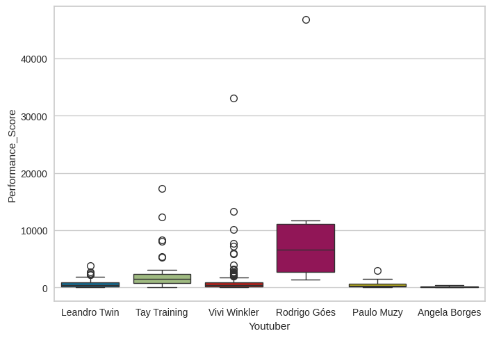

# Youtube competitors Analysis | Análise de competidores no Youtube

**English:**
👉 The complete analysis with results, final remarks and recommendations is available here: [youtube_competitors_analysis.ipynb](youtube_competitors_analysis.ipynb) 

**Português:**
👉 A análise completa com resultados, considerações finais e recomendações está disponível aqui: [youtube_competitors_analysis.ipynb](youtube_competitors_analysis.ipynb)  

## 📊 Youtube competitor Analysis Preview | Visualização Prévia da análise de competidores no Youtube

## 📊 Data Overview | Visão Geral dos Dados
**English:** This project analyzes data from competitors on Youtube data data including:
- **General information file**: day of the week, date, daily views, total views, daily videos, total videos, youtuber
- **Csv files containing technical informations**: id, title, publishedAt (date of publication), views, likes, dislikes, comments

**Português:** Este projeto analisa dados de competidores no Youtube, incluindo:
- **Arquivo com informação geral**: dia da semana, data, visualizações diárias, visualizações totais, vídeos diários, vídeos totais, youtuber
- **Arquivos csv contendo informações técnicas**: id, título, publicadoem (data de publicação), visualizações, curtidas, não-curtidas, comentários

## ✨ Key Features | Principais Funcionalidades
- **Best topics to make videos about selection** | **Seleção dos melhores tópicos para fazer vídeo sobre**
- **Best time of publication analysis** | **Análise do melhor horário para publicação**
- **Regular vs short videos comparison** | **Comparação entre vídeos com duração regular e shorts (vídeos curtos)**
- **Video word count performance analysis** | **Análise da performance dos vídeos em relação à quantidade de palavras ditas**
- **Publication frequency effect on channel's growth analysis** | **Análise da frequência de publicação no crescimento do canal**

## 📁 Files Included | Arquivos Incluídos
- `youtube_competitor_analysis.png` - Screenshot of one of the results | Captura de tela de um dos resultados
- `youtube_competitor_analysis/youtube_data` -  Data folder with files | Pasta contendo os arquivo de dados
- `youtube_competitors_analysis.ipynb` - Jupyter notebook with complete analysis | Jupyter notebook com análise completa 

